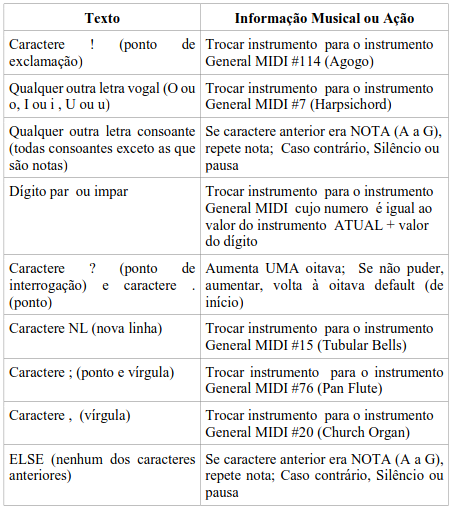

# Trabalho Final - TCP

Trabalho final da disciplina de Técnicas de Construção de Programas

UFRGS - 2022/2

## Descrição

O objetivo do trabalho é a definição, implementação, teste e depuração de um
gerador de música a partir de texto, um software que recebe um texto livre
(não estruturado, como um conto ou uma página de jornal) como entrada e gera um
conjunto de notas correspondentes ao texto segundo alguns parâmetros
(timbre, volume, instrumento, etc).
Os parâmetros são definidos através de um mapeamento de texto para informações musicais.

## Mapeamento

O mapeamento proposto é o seguinte:

  
  

## Funcionalidades

- Entrada de texto livre na caixa de texto;
- Entrada de texto através de arquivo de texto (.txt);
- Seleção de instrumentos e BPM
- Reprodução da música;
- Salvar a música em arquivo MIDI (.mid).

## Dependências

Este trabalho utiliza o pacote NuGet [NAudio.Midi](https://www.nuget.org/packages/NAudio.Midi)

## Interface

_screenshots_